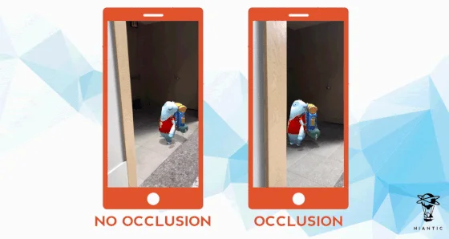

# Alternatives to Vuforia

Besides **ARFoundation** and **Vuforia**, there are several other alternatives you can explore to see whether they better suit your needs when developing AR apps:

***

### Native AR  frameworks

<h4 align="center">ARKit</h4>



<h4 align="center">ARCore</h4>



***

### Cross-Platform AR SDKs


Similar to **ARFoundation** and **Vuforia**.


<h4 align="center">Niantic ARDK (With Unity SDK)</h4>

<figure><figcaption></figcaption></figure>



<h4 align="center">Immersal (With Unity SDK)</h4>

<figure><figcaption></figcaption></figure>



<h4 align="center">artoolkitX</h4>



<h4 align="center">EasyAR (with Unity SDK)</h4>



<h4 align="center">MAXST (With Unity SDK)</h4>



***

### WebAR Platforms

<h4 align="center">8th Wall</h4>



<h4 align="center">Zappar</h4>



