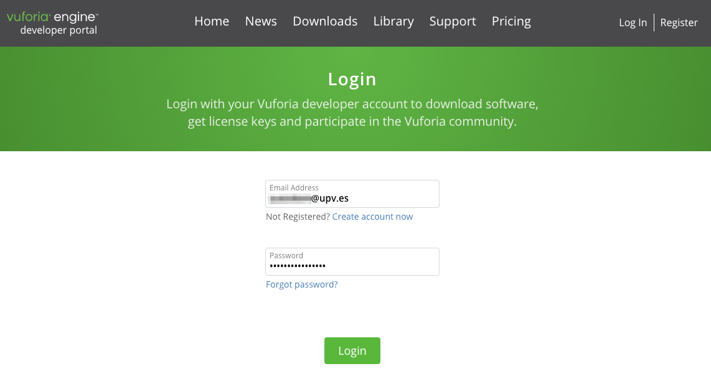
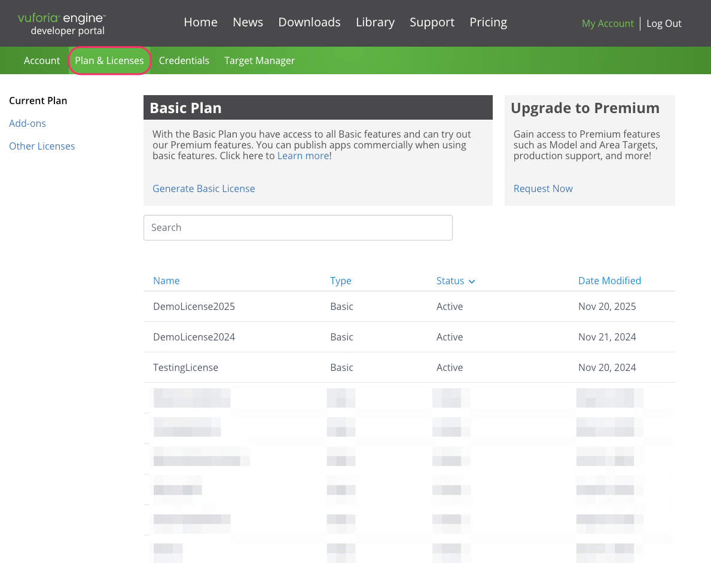
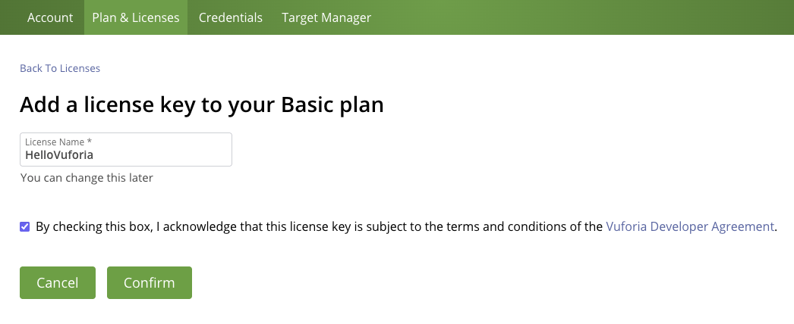
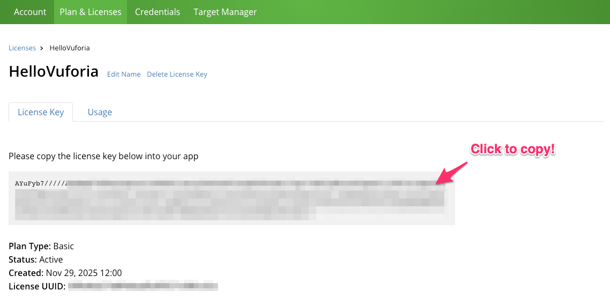

# Account creation

To use this tool in Unity, you must first create an account on the following website:



Once your account is created, log in to the platform:

<figure><figcaption></figcaption></figure>

***

### Plan & License

After logging in, you will see a window similar to the one below, showing all your licenses, both Basic (free) and Premium (paid):

<figure><figcaption></figcaption></figure>


If you just created your account, the list will naturally be empty.


You will need a Vuforia license **for each application**, as this key unlocks access to the library’s essential features.

***

### Getting a Basic free license

In the "Pan & Licenses" web, click on the "[**Generate Basic License**](https://developer.vuforia.com/develop/licenses/free/new)" link. This will load a new page where you have to write the name of your licens, and accept the [Vuforia Developer Agreement](https://developer.vuforia.com/legal/vuforia-developer-agreement):

<figure><figcaption></figcaption></figure>

After creating the license, you will be redirected to the page with your licenses. Click on your newly created license to **get the key**, we will need to paste into Unity:

<figure><figcaption></figcaption></figure>
