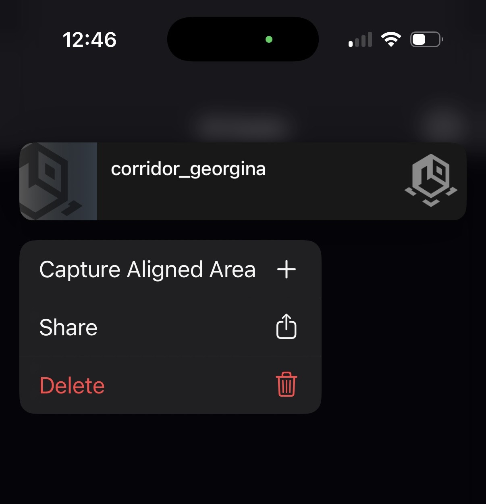
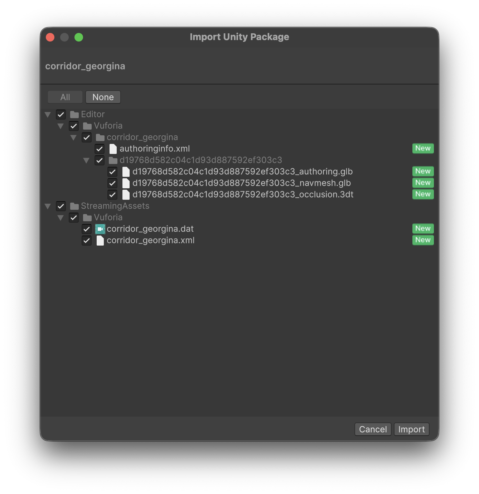
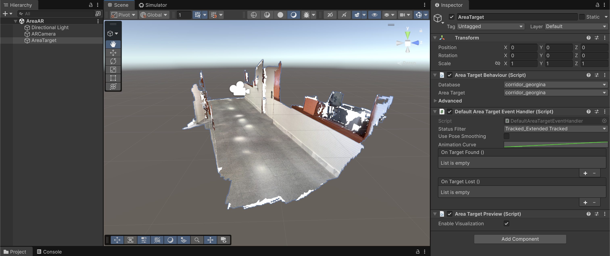
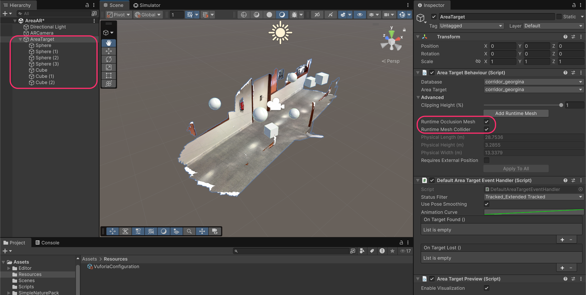
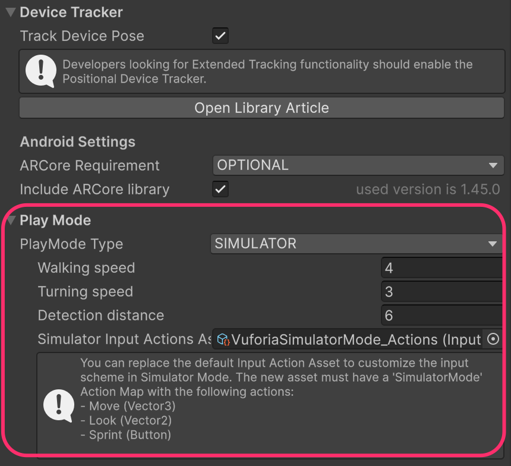
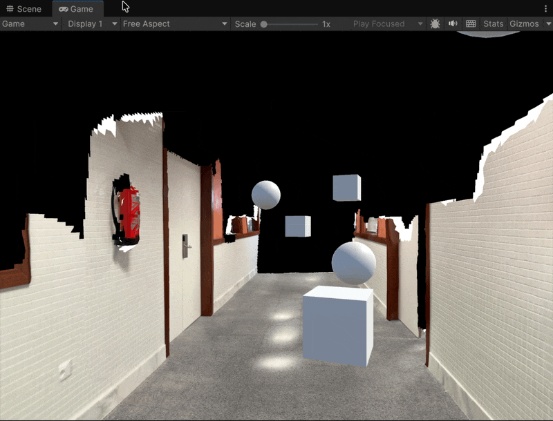

# Area Targets

An Area Target in Vuforia is a special type of trackable that allows us to:

* Pre-scan an environment using a specialized device, such as an iPhone/iPad with LiDAR
* Export the scanned environment to Unity for development
* Detect the environment in AR



#### <mark style="background-color:$info;">Note on Android users for scanning</mark>

**Scanning an environment** can only be done if you have an iPhone/iPad, since the app that scans the environment is only available for iOS devices:



However, the developed app **can be developed** for both **Android** and **iOS** devices.

***

## Creating an Area Target with the Vuforia Creator app

* **Download** the _Vuforia Creator_ app on an iOS app
* Open the app and enter your Vuforia **credentials**
* Create a **new asset** of type "_Capture Area_" and save it

<figure><figcaption></figcaption></figure> <figure><figcaption>
Scanning workflow
</figcaption></figure>

* **Long press** on the asset and **share it** with your computer

<figure><figcaption></figcaption></figure>

* The exported file will be a .zip file. **Unzip** it, locate the _.unitypackage_ file and double-click on it while the Unity project (with the Vuforia SDK) is open to import it

<figure><figcaption></figcaption></figure>

***

## Scene setup

* Replace the **Main Camera** with the Vuforia's **AR Camera** (as usual), making sure the App License Key is setup
* Create a _Vuforia Engine → Area Target → Area Target_


Since there is only one asset, your scanned map will appear automatically


<figure><figcaption></figcaption></figure>

* Add **children GameObjects**, since an Area Target behaves like the other targets we have seen so far. For this example, we will add some **cubes** and **spheres**, some of them with **rigidbodies**.


Vuforia is capable of performing automatic occlusion and collision if needed.


<figure><figcaption></figcaption></figure>

* Test the app inside the Unity Editor by changing the **PlayMode Type** from WEBCAM to **SIMULATOR** in the Vuforia Configuration file

<figure><figcaption></figcaption></figure> <figure><figcaption></figcaption></figure>

* Since the target might be found after the scene executes, elements affected by the **physics engine** will **fall into the void**. To avoid this, uncheck the "`Use Gravity`" property on the GameObjects with a `RigidBody` component
* Now, **when the target is found**, activate that property back

<figure><figcaption></figcaption></figure>

### Result

<figure><figcaption></figcaption></figure>
