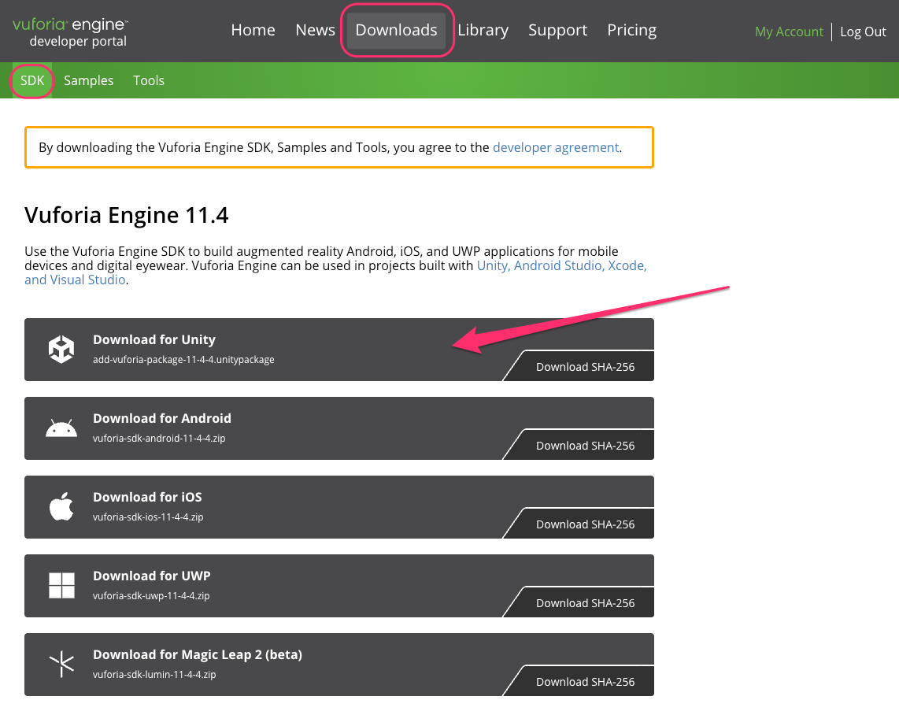
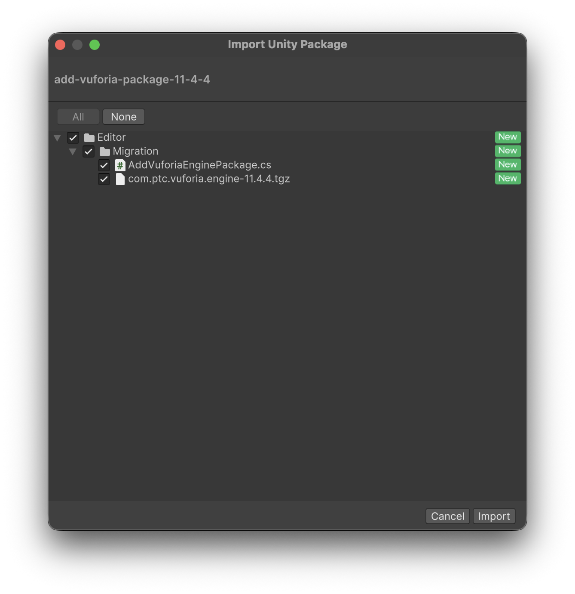
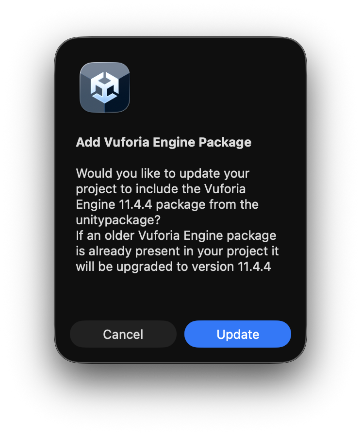
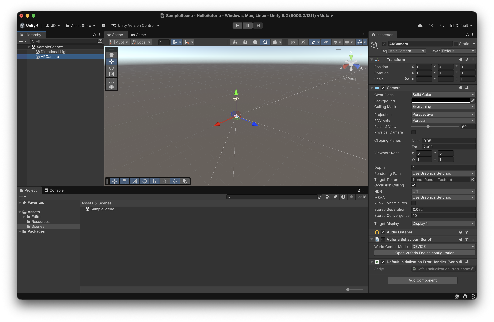
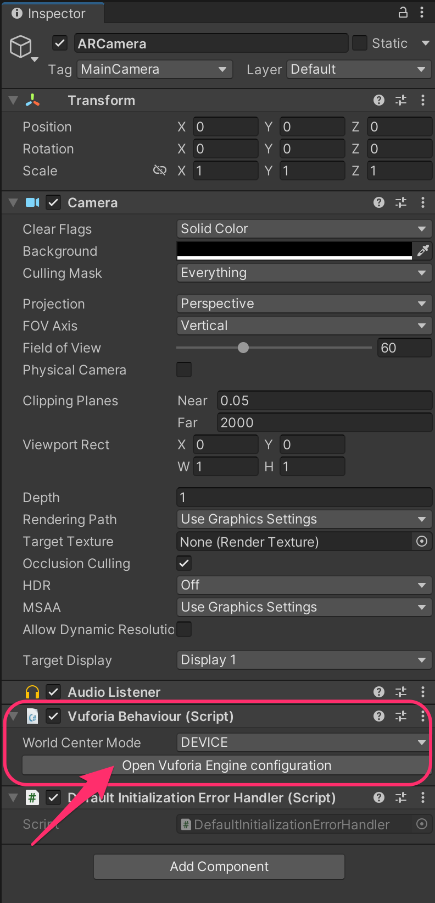
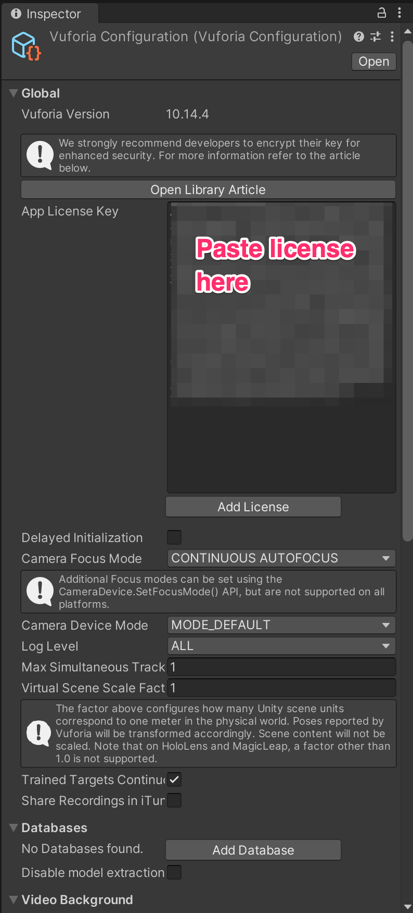
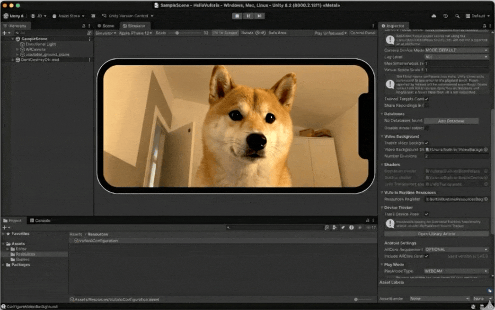
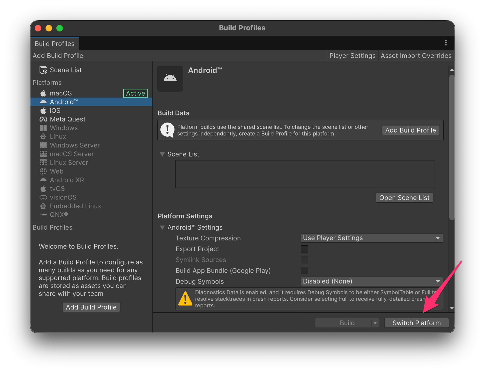

# Creating a Unity project with Vuforia

### **Importing Vuforia**

**AFTER** creating your license key, download the Vuforia SDK from their website, in the Downloads section:

<figure><figcaption></figcaption></figure>

The next step is to **create a new Unity project** and **add the pacakge** we have just downloaded (after creating the project, double-click on the _add-vuforia-package-X-Y-Z.unitypackage_ file):

<figure><figcaption></figcaption></figure> <figure><figcaption></figcaption></figure>

***

### Creating an AR Camera

Whenever we want to turn a normal Unity scene into an AR scene, we need to:

* **Remove** the **Main Camera** GameObject
* **Add** a new **AR Camera** Gameobject from the _**GameObject**_**&#x20;→&#x20;**_**Vuforia Engine**_ menu

<figure><figcaption></figcaption></figure>

This GameObject has a `VuforiaBehaviour` component we can use to configure Vuforia for our project by clickin on its "Open Vuforia Engine configuration" button:

<figure><figcaption></figcaption></figure> <figure><figcaption></figcaption></figure>

***

### Testing the app

#### In the Unity Editor

By default, Vuforia will try to look for the **webcam on your computer**; however, if you have more than one, you can select which one to use in the same Vuforia Configuration asset:

<figure><figcaption></figcaption></figure>

<figure><figcaption></figcaption></figure>

#### In Android

* Open the **Build Profiles** window, select **Android** and click on "Switch Platform"

<figure><figcaption></figcaption></figure>

* Open the **Player Setting** window (from within the same Build Profiles window, you can open the Player Settings from the top bar)
  * Specify a "Company Name"
  * Set the "Minimum API Level" to 10.0 (API level 29)
* Go back to the **Build Profiles** window, **connect an Android** device by cable to your computer and click on "**Build & Run**"
