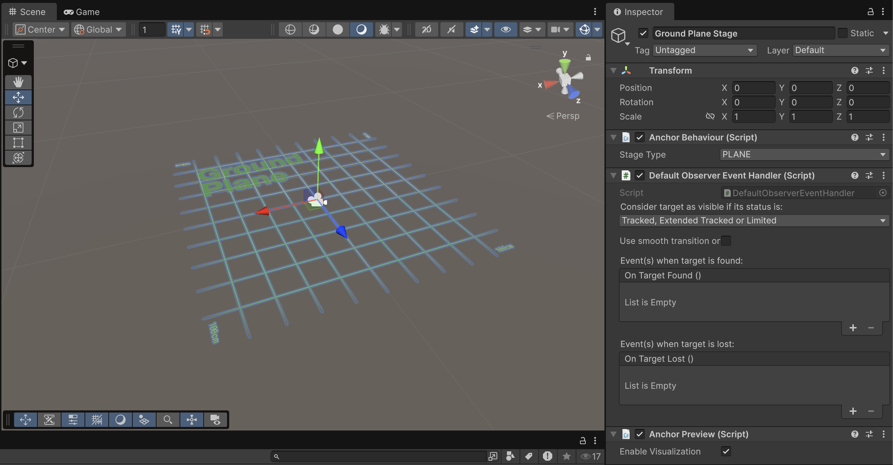
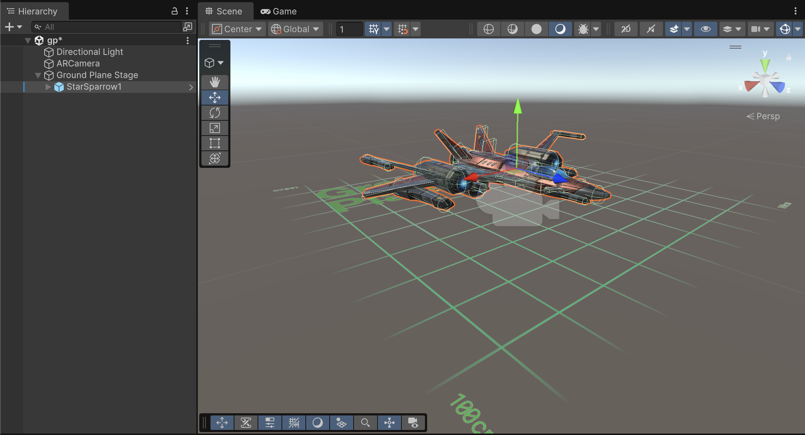
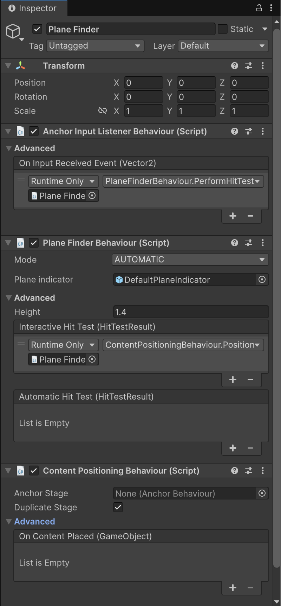
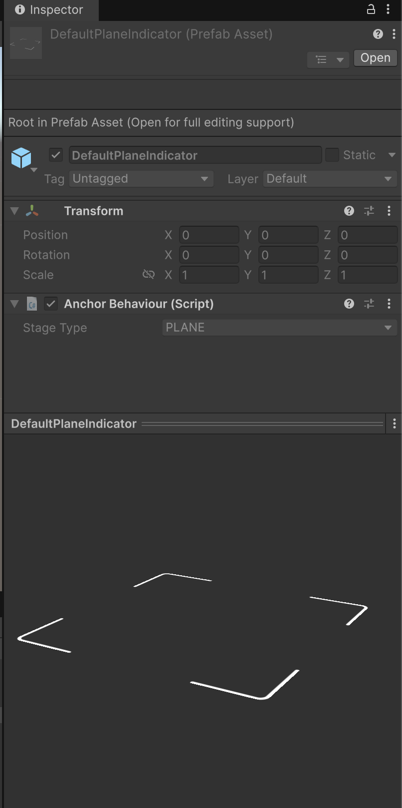
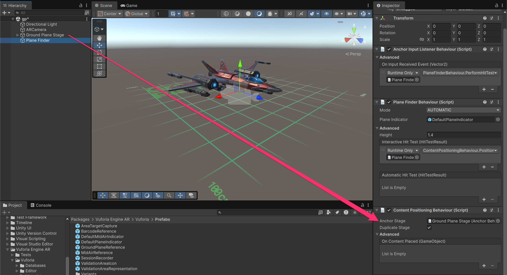

# Ground Plane Detection

This feature makes it possible to place synthetic content on any flat horizontal/vertical surface, without requiring a specific reference image. Examples include:

* Floors
* Tables
* Platforms
* …

<figure><figcaption></figcaption></figure>




Keep in mind that Vuforia target types aren't mutually exclusive. You can combine different kinds of targets (image, ground, area, etc.) within the same scene.


#### Steps to place the content

Unlike Image Targets, where content is overlaid when the camera detects a specific image, placing an element using a **Ground Plane** requires the following steps:

1. **Scan the area:**\
   Vuforia displays a virtual mesh that represents the scanned floor. To generate it, the user must move the device around the area in a sweeping motion.
2. **Interact with the mesh:**\
   By performing actions such as tapping on the virtual mesh, the user can place and interact with the synthetic content.

#### Area requirements

* Lighting conditions must be good.
* The surface should be medium to large in size (at least **0.5 m** for proper detection) so that Vuforia can generate and overlay the virtual mesh correctly.

***

## Step by step example

* In a new scene, replace the **Main Camera** with a **Vuforia camera**.
* From the top menu, go to _GameObject → Vuforia Engine → Ground Plane_\
  and add a **Ground Plane Stage** object to the scene.

<figure><figcaption></figcaption></figure>


This object works like an Image Target, but for detected horizontal surfaces. **Any content** that we want to **anchor to “reality”** must be placed as a **child of this object**.

You can think of it as the horizontal surface where the scene’s content will appear.


* Add any spaceship from the following package as a child of the Ground Plane Stage GameObject (you might need to scale the spaceship down).



<figure><figcaption></figcaption></figure>

* From the menu _GameObject → Vuforia Engine → Ground Plan_**e**, add a **Plane Finder** object to the scene (at the root level, with no parent) with the default parameters.

<figure><figcaption></figcaption></figure> <figure><figcaption></figcaption></figure>


This GameObject components are in charge of:

* `AnchorInputListenerBehaviour`: Detect touches on the screen
* `PlaneFinderBehaviour`: Detect valid planes in the scene and show the virtual mesh (it shows a DefaultPlaneIndicator GameObject)
* `ContentPositioningBehaviour`: Anchor the content in the scene


* Drag the **Ground Plane Stage** GameObject into the _"Anchor Stage"_ property of the `ContentPositioningBehaviour` component in the Plane Finder.

<figure><figcaption></figcaption></figure>


The _"Duplicate Stag&#x65;**"**_ property determines the behavior when tapping on the virtual mesh:

* If it is enabled, each tap will duplicate the **Ground Plane Stage** and therefore all of its content.
* If it is disabled, tapping will simply reposition the existing **Ground Plane Stage** in the new location.


### Testing in the Unity editor

Since Ground Plane isn't a standard Image Target, Vuforia provides a workaround for testing before deploying to a physical device.&#x20;

You can use the emulator image located at _Assets → Editor → Vuforia → ImageTargetTextures → VuforiaEmulator → emulator\_ground\_plane\_scaled.jpg_ and display it to your webcam.

<figure><figcaption></figcaption></figure>

### Result

<figure><figcaption></figcaption></figure>
