# GeoAR Exercise

This exercise walks through creating a simple **Geo‑AR** app:

* The app constantly reads the user’s GPS position.
* When the user enters a given radius around a target location, a **“Show model”** button becomes available.
* Pressing the button places a 3D model on a detected ground plane using **Vuforia Ground Plane Detection**.XR - Practice 08 - GeoAR

***

## Geolocalized AR & GPS

Geolocalized AR (GeoAR) means that AR content and interactions depend on **where the user is on Earth**, typically using GPS latitude and longitude.

#### How GPS works (short version)

* GPS uses a constellation of **\~30+ satellites** orbiting Earth.
* Your phone’s GPS chip measures how long signals take to travel from satellites, and from this computes your latitude/longitude.
* Accuracy is limited (often 3–15 meters outdoors), so you **must use a radius**, not exact equality, when checking whether the user is “at” a point.

<div><figure><figcaption></figcaption></figure> <figure>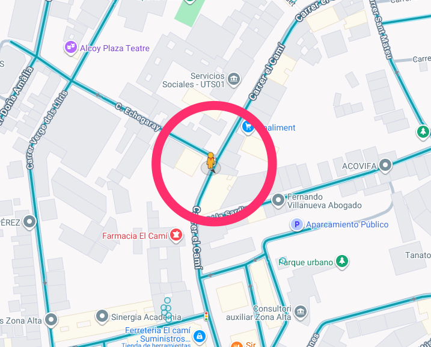<figcaption></figcaption></figure></div>

***

## 1. Project creation & UI setup

* Create a new Unity project (or re-use any existing one) and install de Vuforia package&#x20;
* In a scene with the **ARCamera**:
  * Add a **Canvas**.
  * Inside the Canvas, create:
    * A **top panel** with:
      * **Button** "Show Model"
      * **Button** "Reset Planes"
    * A **center panel** that will say “In area!” with a **Close** button.
    * A **bottom label** to debug the distance in meters (from the user position to the target position).

<div><figure>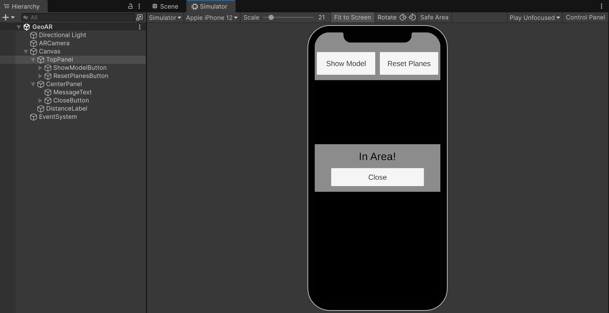<figcaption></figcaption></figure> <figure>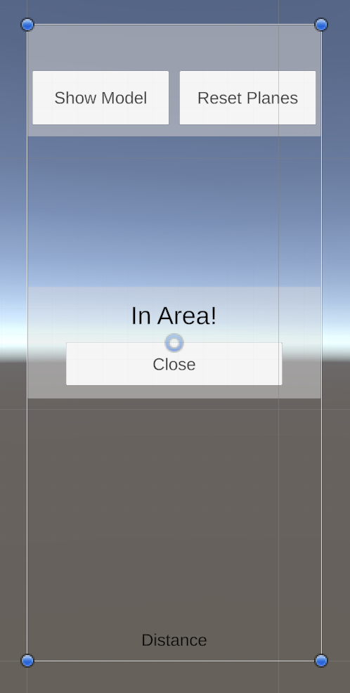<figcaption></figcaption></figure></div>

* Add a `CanvasGroup` component to **CenterPanel**. This lets us hide/show the whole panel (and its children) by changing its `alpha` and `blocksRaycasts` properties.
  * Initial settings in the Inspector for **CenterPanel**:
    * `Alpha = 0` (invisible at start)
    * `Interactable = false`
    * `Blocks Raycasts = false`

We only want the "Show model" button to be **usable once the user is near the destination**.

* Select "ShowModelButton".
* Uncheck the `Interactable` property on the `Button` component.

<figure>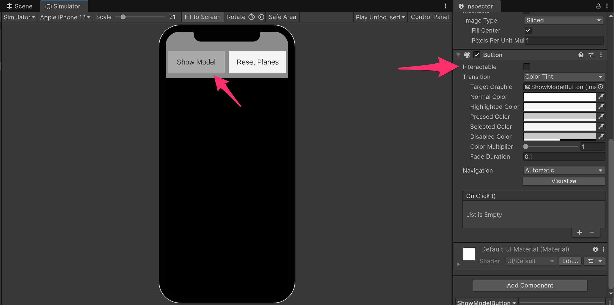<figcaption></figcaption></figure>

***

## 2. GPS & Localization scripting

Create a script named **`GPSManager`** and attach it to an empty GameObject, e.g. `GeoManager` in the scene.

<figure><figcaption></figcaption></figure>

We’ll use Unity’s **LocationService** via `Input.location` to read GPS coordinates.



#### Coordinates data class

* At the top of `GPSManager.cs`:


```csharp
using System;
using System.Collections;
using TMPro;
using UnityEngine;
using UnityEngine.Events;

[Serializable]
public class Coordinates
{
    public float lat; // latitude
    public float lon; // longitude
}
```



Because the class is marked with `[Serializable]`, you can edit `lat` and `lon` directly in the **Inspector** when a variable of type `Coordinates` is a public field.


#### GPSManager fields

* Below the `Coordinates` class, add the `GPSManager` definition:


```csharp
public class GPSManager : MonoBehaviour
{
    [Header("Destination")]
    public Coordinates destination;                 // where we want the user to reach
    public float radius = 20f;                      // meters around the destination
    public float updateTime = 2f;                   // seconds between GPS checks

    [Header("UI References")]
    public CanvasGroup destinationArrivedViewCg;    // center panel CanvasGroup
    public TextMeshProUGUI distanceDebugText;       // bottom label for distance

    [Header("Events")]
    public UnityEvent onAreaReached = new UnityEvent();

    // internal state
    private double _distance;
    private Coordinates _userLocation = new Coordinates();
    private bool _userArrivedAtDestination = false;
}
```


In the **Inspector**:

* Assign `destinationArrivedViewCg` = the `CenterPanel` CanvasGroup.
* Assign `distanceDebugText` = your bottom DistanceLabel GameObject.

<figure>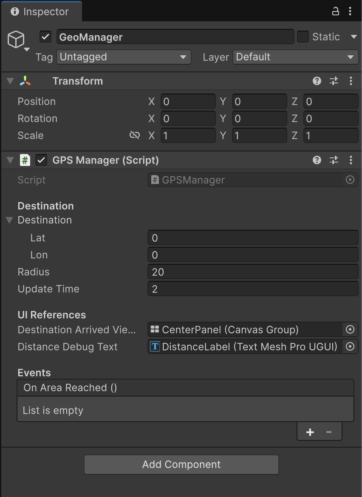<figcaption></figcaption></figure>

* Inside `GPSManager`, add:


```csharp
public void ShowDestinationArrivedView()
{
    destinationArrivedViewCg.alpha = 1f;
    destinationArrivedViewCg.interactable = true;
    destinationArrivedViewCg.blocksRaycasts = true;
}

public void HideDestinationArrivedView()
{
    destinationArrivedViewCg.alpha = 0f;
    destinationArrivedViewCg.interactable = false;
    destinationArrivedViewCg.blocksRaycasts = false;
}
```



We’ll call these when the user **enters** or **leave** the destination area, and when they press the **Close** button.


#### Starting the GPS & update loop

* Add `Start()` and the main coroutine:


```csharp
private void Start()
{
    // Start the GPS service (this may prompt the user for permission)
    Input.location.Start();

    // Periodically check the device location
    StartCoroutine(CheckLocation());
}

private IEnumerator CheckLocation()
{
    var wait = new WaitForSeconds(updateTime);

    while (true)
    {
        if (Input.location.isEnabledByUser)
        {
            var data = Input.location.lastData;  // latitude & longitude
            _userLocation.lat = data.latitude;
            _userLocation.lon = data.longitude;

            _distance = CalculateDistance(destination, _userLocation);
            distanceDebugText.text = $"Distance: {_distance:F2} m";

            if (_distance < radius)
            {
                // We are inside the area
                if (!_userArrivedAtDestination)
                {
                    ShowDestinationArrivedView();
                    onAreaReached?.Invoke(); // fire event only once when entering
                }

                _userArrivedAtDestination = true;
            }
            else
            {
                // We are outside the area
                HideDestinationArrivedView();
                _userArrivedAtDestination = false;
            }
        }

        yield return wait;
    }
}
```



For production, you should also check `Input.location.status` (Initializing/Failed/etc.) as suggested in the Unity docs.


#### Distance between two coordinates (_Haversine_)

We’ll use the _**Haversine formula**_ to compute the great‑circle distance between two points given their latitudes and longitudes (good approximation assuming Earth as a sphere).

* Add this method to `GPSManager`:


```csharp
private static double CalculateDistance(Coordinates coords1, Coordinates coords2)
{
    // ---- Haversine formula ----
    const double r = 6378.137; // Radius of earth in KM

    var dLat = coords2.lat * Mathf.PI / 180 - coords1.lat * Mathf.PI / 180;
    var dLon = coords2.lon * Mathf.PI / 180 - coords1.lon * Mathf.PI / 180;

    var a = Mathf.Sin(dLat / 2) * Mathf.Sin(dLat / 2) +
            Mathf.Cos(coords1.lat * Mathf.PI / 180) *
            Mathf.Cos(coords2.lat * Mathf.PI / 180) *
            Mathf.Sin(dLon / 2) * Mathf.Sin(dLon / 2);

    var c = 2 * Mathf.Atan2(Mathf.Sqrt(a), Mathf.Sqrt(1 - a));

    return r * c * 1000; // meters
}
```




#### Hooking up the Close button

* Select `CloseButton` in the center panel.
* In the Button’s **OnClick()** event:
  * Drag the `GeoManager` (with `GPSManager` component).
  * Choose `GPSManager → HideDestinationArrivedView()`.

<figure>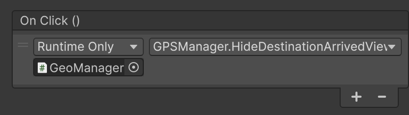<figcaption></figcaption></figure>

Now the user will be able to hide the info panel after entering the target area.

#### Wiring the “area reached” event to enable the button

We want **ShowModelButton** to become "interactable" when the user first enters the area:

* In the Inspector, select the GameObject with `GPSManager`.
* In the **On Area Reached** (our `UnityEvent`) event:
  * Add a new entry and drag the **ShowModelButton**.
  * In the dropdown, select `Button → interactable`.
  * Set the checkbox to `true`.

<figure>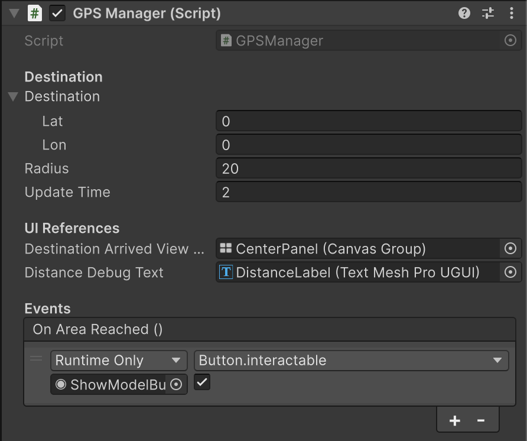<figcaption></figcaption></figure>

Now, when the event fires for the first time, the button will become usable.

#### Setting the destination coordinates

Use **Google Maps** (or similar) to find the point where you want AR content to unlock:

<figure>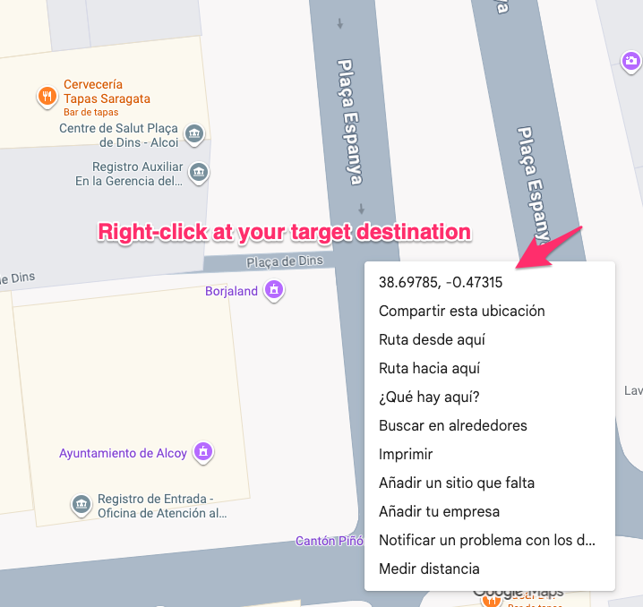<figcaption></figcaption></figure>

* Right‑click on the map and copy the coordinated (latitude, longitude).
* Back in Unity, select `GeoManager` in the editor and paste them


Remember GPS isn’t exact, so adjust `radius` (e.g. 20–50 meters) for a smoother experience


<figure>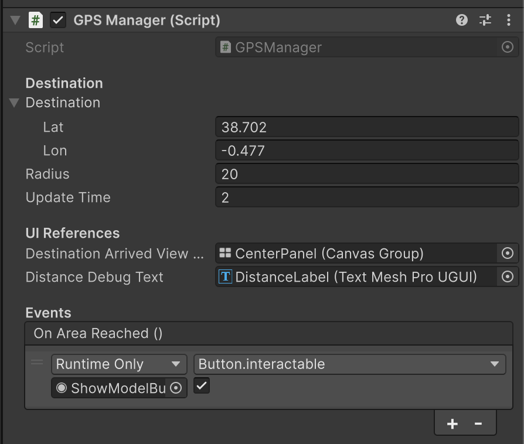<figcaption></figcaption></figure>

#### <mark style="background-color:$info;">iOS build note – Camera & Location usage descriptions</mark>

On iOS, you **must** provide a reason string for camera and location access:

* In Unity, open _Edit → Project Settings → Player →_ iOS tab.
* Under **Other Settings / Configuration**:
  * Set **Camera Usage Description** (e.g. “Needed to display AR content.”).
  * Set **Location Usage Description** (e.g. “Needed to unlock AR content near your location.”).



These values end up in your app’s **Info.plist** as `NSCameraUsageDescription` and `NSLocationWhenInUseUsageDescription`, which iOS shows in permission dialogs.

***

## 3. Surface Tracking with Vuforia Ground Plane

Next, we'll integrate the **Vuforia Ground Plane** tracking strategy, which detects flat surfaces and lets us place our 3D model horizontal surfaces.



#### Add Vuforia and replace the Main Camera with Vuforia’s ARCamera

* Import the Vuforia package
* Delete the default **Main Camera**
* Add _GameObject → Vuforia → AR Camera_
* In the ARCamera’s **Vuforia Configuration**:
  * Paste your **License Key**
  * Enable **Track Device Pose** (needed for Ground Plane)

<figure>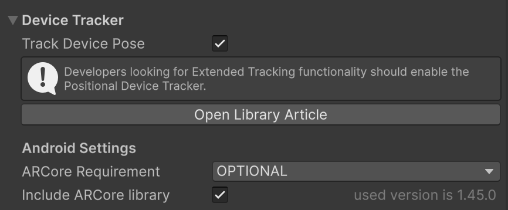<figcaption></figcaption></figure>

#### Create a Ground Plane Stage

* Add _GameObject → Vuforia → Ground Plane → Ground Plane Stage_.
  * Remember that the "_Ground Plane Stage"_ is analogous to an ImageTarget: it acts as the **parent** of your AR content.

<figure>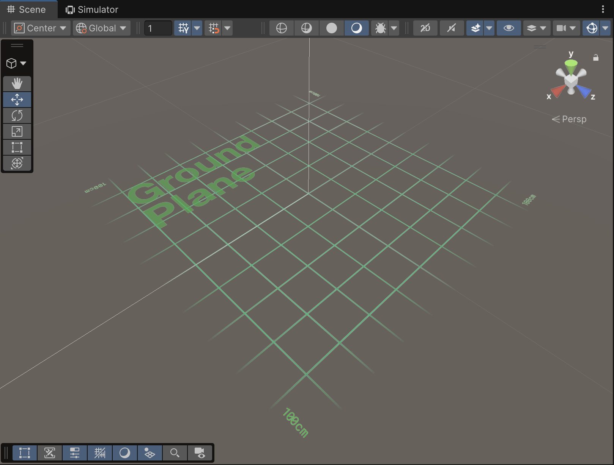<figcaption></figcaption></figure>


Remember that the "Ground Plane Stage" has a grid gizmo in the editor only; it won’t render at runtime.


#### Add a Plane Finder

* Add _GameObject → Vuforia → Ground Plane → Plane Finder_
* The `PlaneFinderBehaviour`:
  * Scans the environment to detect horizontal planes.
  * Raises hit test events when it finds valid surfaces.

In the Plane Finder’s `ContentPositioningBehaviour` component:

* `Anchor Stage` → Drag the **Ground Plane Stage**.
* Uncheck **Duplicate Stage** (we only want one stage & one model instance).

<figure>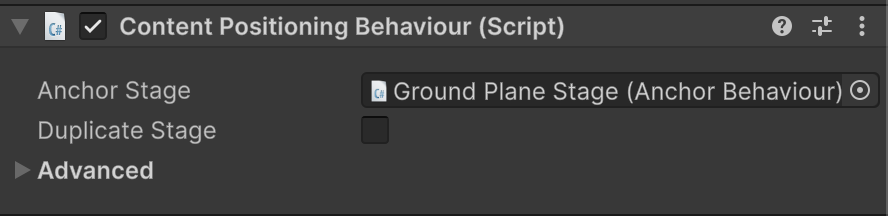<figcaption></figcaption></figure>

* Also, remove the default listener from the `AnchorInputListenerBehaviour`  and `PlaneFinderBehaviour` events.

<figure>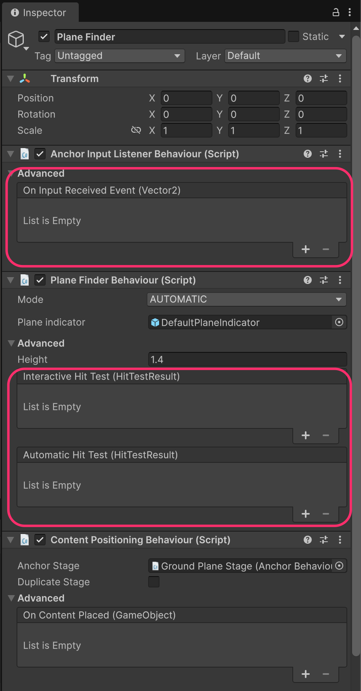<figcaption></figcaption></figure>

#### Add the 3D model

Import any 3D model you like (e.g. from the Unity Asset Store or a `.fbx`/`.obj` file)

* Drag the model under **Ground Plane Stage** in the Hierarchy
* Reset its local position/rotation as needed and scale it appropriately

<figure>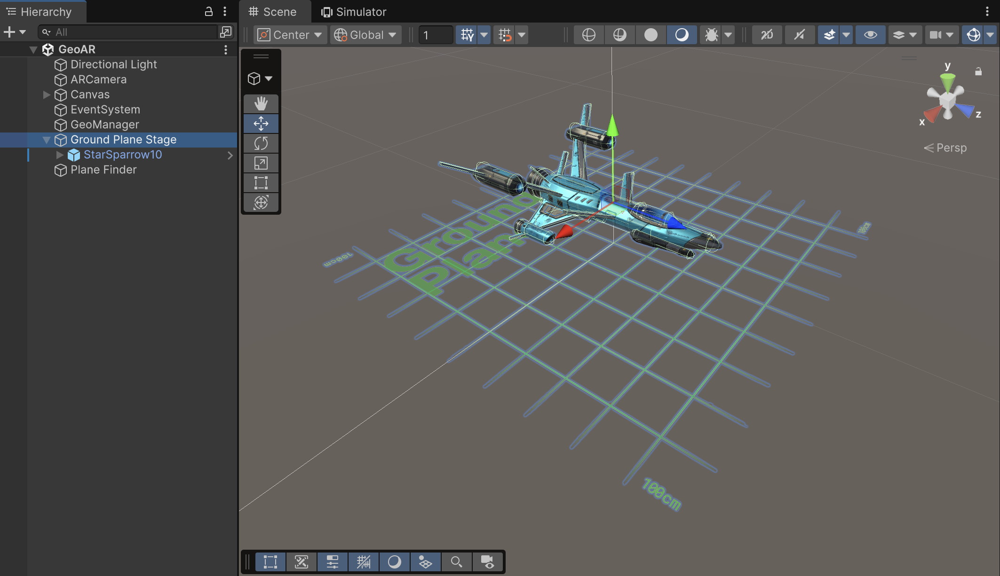<figcaption></figcaption></figure>

***

## 4. AR logic

Create a new script named **`GroundPlaneController`** and attach it to a convenient GameObject (e.g. `ARManager`).

This script connects:

* The **Show model** button → Ground plane hit test.
* Plane Finder hit-test results → content placement.
* The **Reset planes** button → anchor cleanup.

We’ll use Vuforia’s `PlaneFinderBehaviour` and `ContentPositioningBehaviour`.

#### GroundPlaneController


```csharp
using UnityEngine;
using Vuforia;

public class GroundPlaneController : MonoBehaviour
{
    [Header("Vuforia")]
    public PlaneFinderBehaviour planeFinder;
    public ContentPositioningBehaviour contentPositioning;

    [Header("Content")]
    public GameObject modelRoot; // the model under GroundPlaneStage

    private void OnEnable()
    {
        // subscribe to interactive hit tests
        planeFinder.OnInteractiveHitTest.AddListener(HandleInteractiveHitTest);
        planeFinder.HitTestMode = HitTestMode.AUTOMATIC;
    }

    private void OnDisable()
    {
        planeFinder.OnInteractiveHitTest.RemoveListener(HandleInteractiveHitTest);;
    }

    /// <summary>
    /// Called by the "Show model" button.
    /// Simulates a user tap in the center of the screen.
    /// </summary>
    public void PerformHit()
    {
        var screenCenter = new Vector2(Screen.width / 2f, Screen.height / 2f);
        planeFinder.PerformHitTest(screenCenter);
    }

    /// <summary>
    /// Handles successful hit tests by placing our content on the plane.
    /// </summary>
    private void HandleInteractiveHitTest(HitTestResult result)
    {
        if (result == null) return;

        contentPositioning.PositionContentAtPlaneAnchor(result);

        if (!modelRoot.activeSelf)
        {
            modelRoot.SetActive(true);
        }
    }

    /// <summary>
    /// Called by the "Reset planes" button.
    /// Removes anchors and hides the content.
    /// </summary>
    public void ResetTracking()
    {
        modelRoot.SetActive(false);
        contentPositioning.AnchorStage.UnconfigureAnchor();
        VuforiaBehaviour.Instance.DevicePoseBehaviour.Reset();

    }
}
```


#### Assign references in the Inspector

For the GameObject with **GroundPlaneController**:

* `planeFinder` → drag the **Plane Finder**.
* `contentPositioning` → drag the Plane Finder’s **ContentPositioningBehaviour** component.
* `groundPlaneStage` → drag the **Ground Plane Stage** object.
* `modelRoot` → drag your 3D model root object (under Ground Plane Stage).

#### Hooking up the UI buttons

* **Show model button**
  * Select **ShowModelButton**.
  * In **OnClick()**, add the `ARManager` (GroundPlaneController).
  * Choose `GroundPlaneController → PerformHit()`.
* **Reset planes button**
  * Select **ResetPlanesButton**.
  * In **OnClick()**, add the same `ARManager`.
  * Choose `GroundPlaneController → ResetTracking()`.

Now:

* When the user is _not_ at the destination, **Show model** is disabled.
* When they enter the target area, `GPSManager` fires `onAreaReached`, making **Show model** interactable.
* Pressing **Show model** triggers a hit test, and if a plane is detected, the model appears anchored on the ground.
* **Reset planes** clears anchors and hides the model so you can place it again.

***

## Result

<figure><figcaption></figcaption></figure>
