# Image Targets

<figure>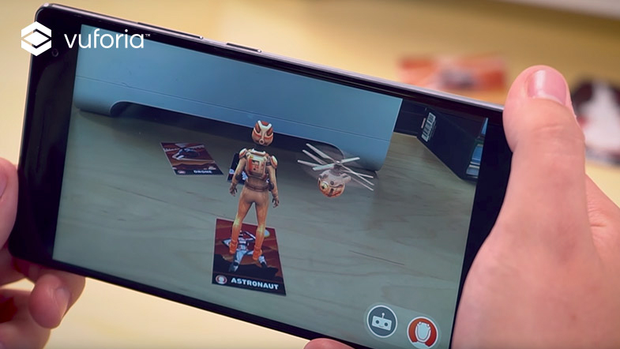<figcaption></figcaption></figure>

An Image Target allows Vuforia to detect and track a flat image in the real environment. This makes it possible to anchor virtual content relative to the position of that image, as shown in the figure below:



***

### Using the sample dataset

In the scene with the **ARCamera**, create an **Image Target**–type GameObject (from the top menu _GameObject_, or by right-clicking in the _Hierarchy_ view):

<figure>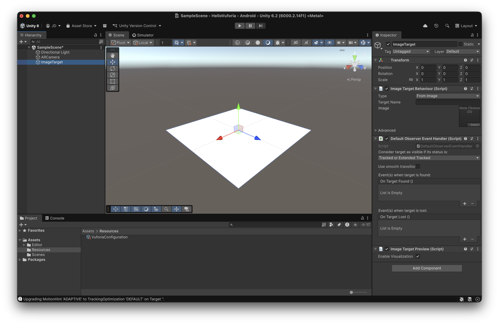<figcaption>
Image Target without an image to track
</figcaption></figure>

If in the `ImageTargetBehavior` component we change the type to ‘From Database’, Vuforia will offer us the option to **install a set of default images**, those from the ‘VuforiaMars\_Images’ database:

<figure>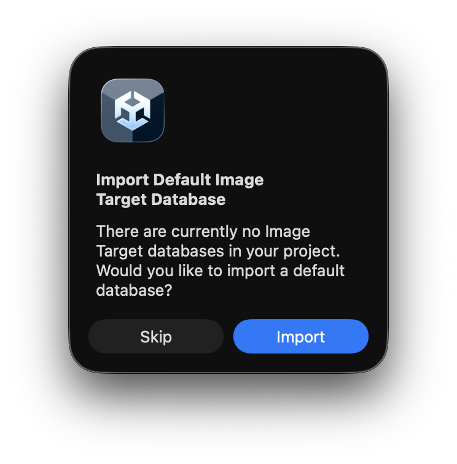<figcaption></figcaption></figure> <figure>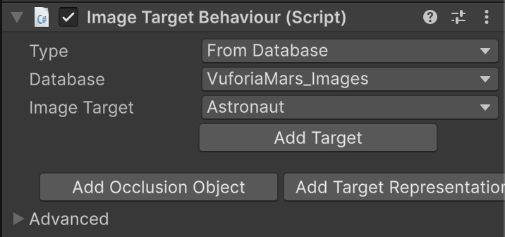<figcaption></figcaption></figure>

Depending on the Image Target we choose, we will be able to track one image or another:

<figure>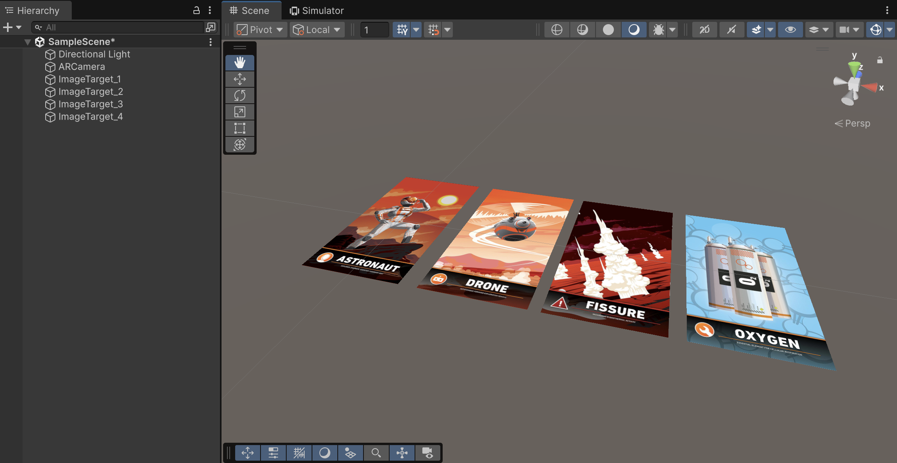<figcaption>
Images from the default dataset
</figcaption></figure>

To anchor synthetic content so that it appears in AR, we must add those GameObjects as **children of the target**:

<figure>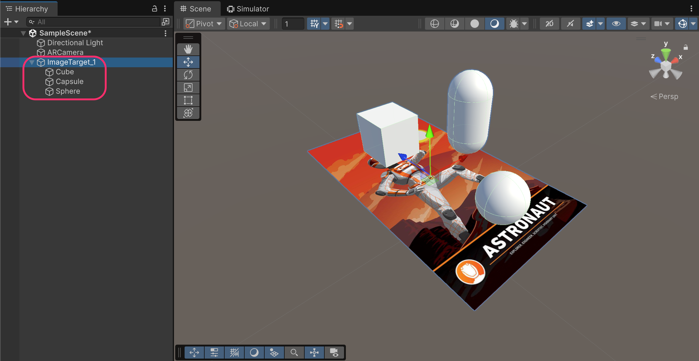<figcaption></figcaption></figure>


The component responsible for showing and hiding the synthetic content is the `DefaultObserverEventHandler`.

This component enables/disables, for the target’s children:

* Renderer
* Collider
* Canvas (UI)

If you want to enable/disable other elements you can either:

* Use the events from the editor (recommended), or
* Create your own script that inherits from DefaultObserverEventHandler (more complex).

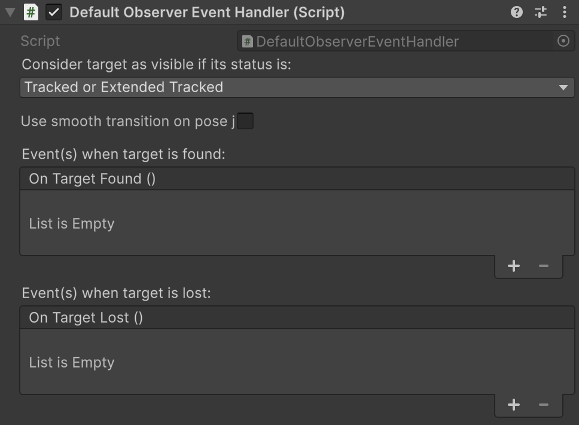


<figure><figcaption></figcaption></figure>

### Creating an image dataset

To create a **custom dataset**, we need to go to the _Vuforia's Target Manager_:



We can add, for instance, these two images:

<figure>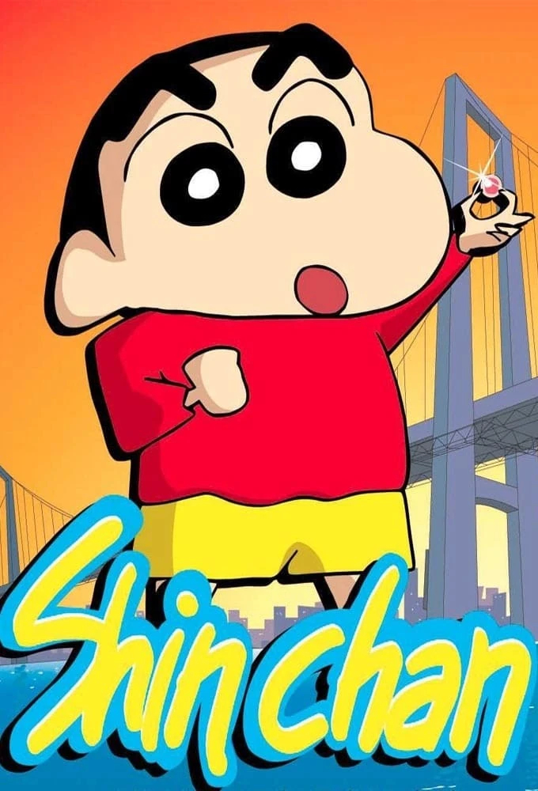<figcaption></figcaption></figure> <figure><figcaption></figcaption></figure>

From the _Target Manager_, we have to **generate a Database**:

<figure>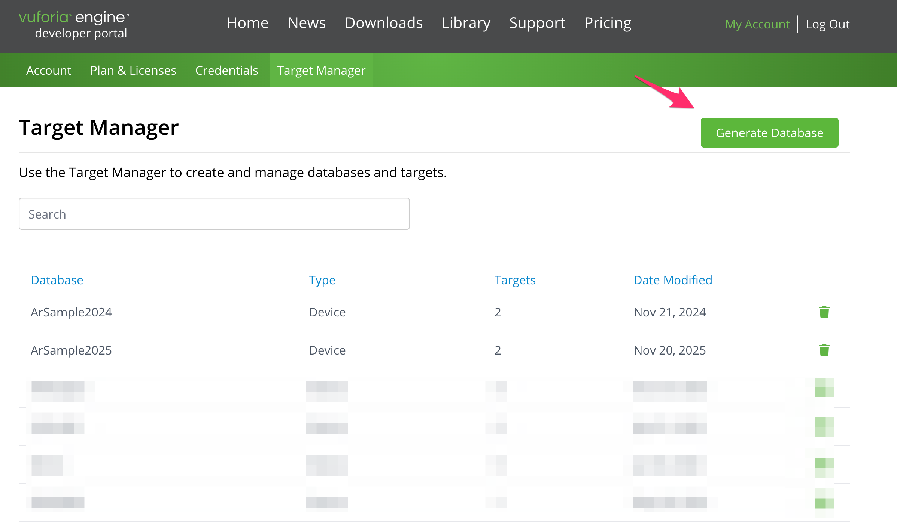<figcaption></figcaption></figure>

<figure>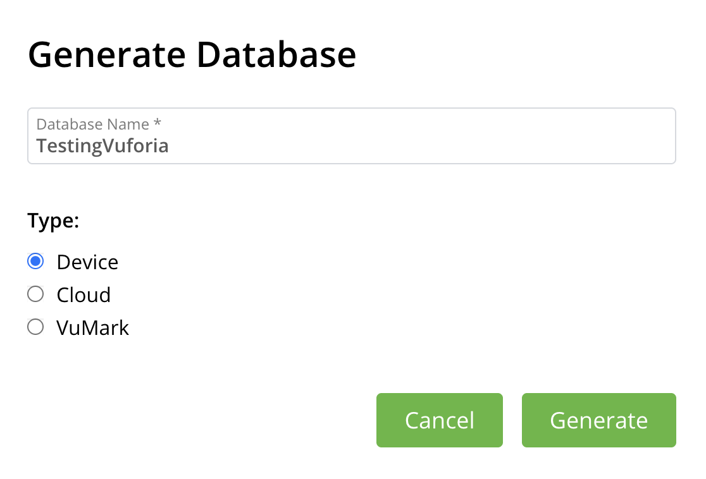<figcaption></figcaption></figure>

After generating the Device Database, we can **add the two images**:

<figure>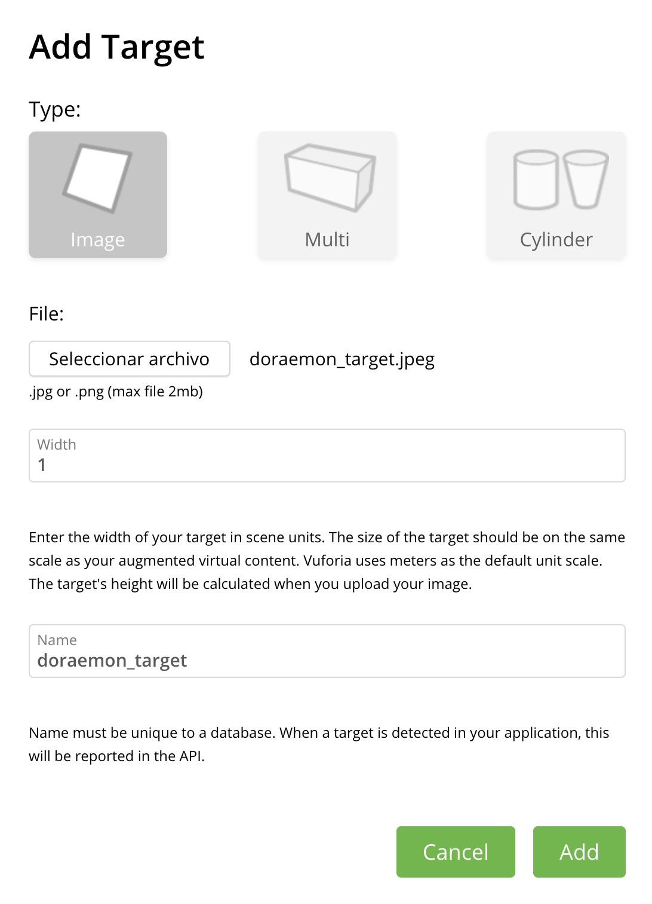<figcaption></figcaption></figure>


It is important to add the width of the real target (in meters) so that the scale is correctly rendered in Unity (1 unit ⇒ 1 meter), though we can set 1 by default.


After adding the two images, we can observe the set of images that belong to the database:

<figure>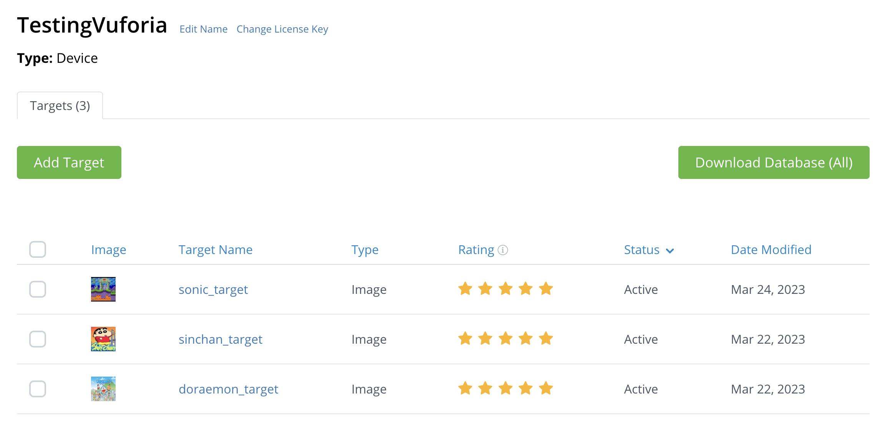<figcaption></figcaption></figure>

If we select a target, we can preview the "**feature points**". The more feature points it has, the better Vuforia will perform in recognizing and tracking it:

<figure>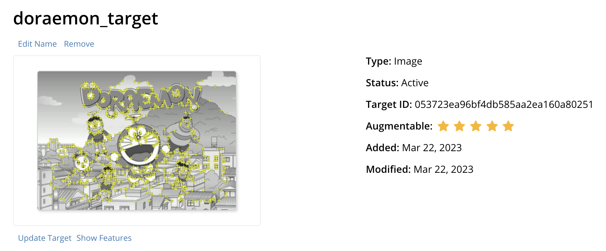<figcaption></figcaption></figure>

The next step is to download the database and import it into the Unity project (by double-clicking on the .unitypackage file):

<figure><figcaption></figcaption></figure>

After that, we will be able to select our database and use their images as targets:

<figure>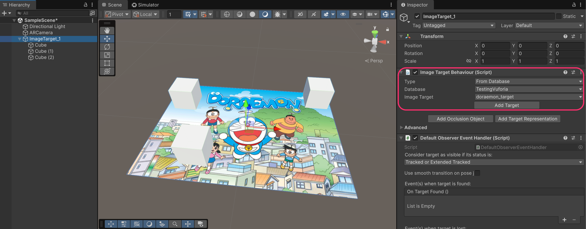<figcaption></figcaption></figure>

<figure>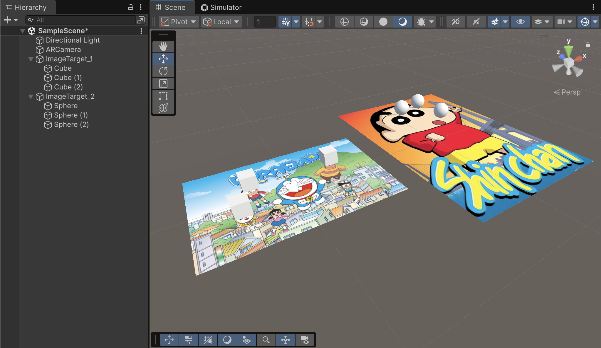<figcaption></figcaption></figure>

<figure><figcaption></figcaption></figure>
