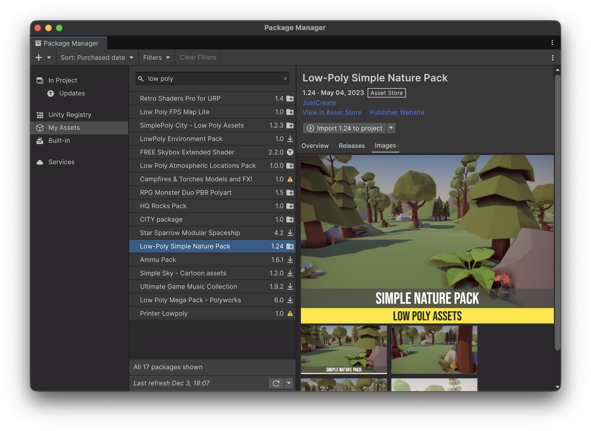
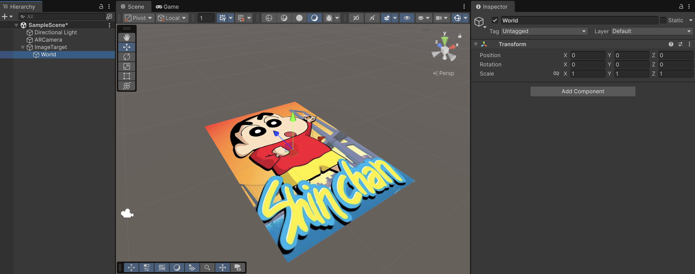
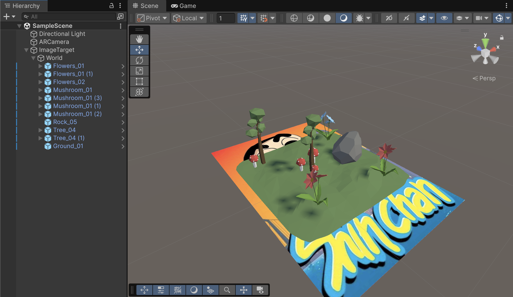
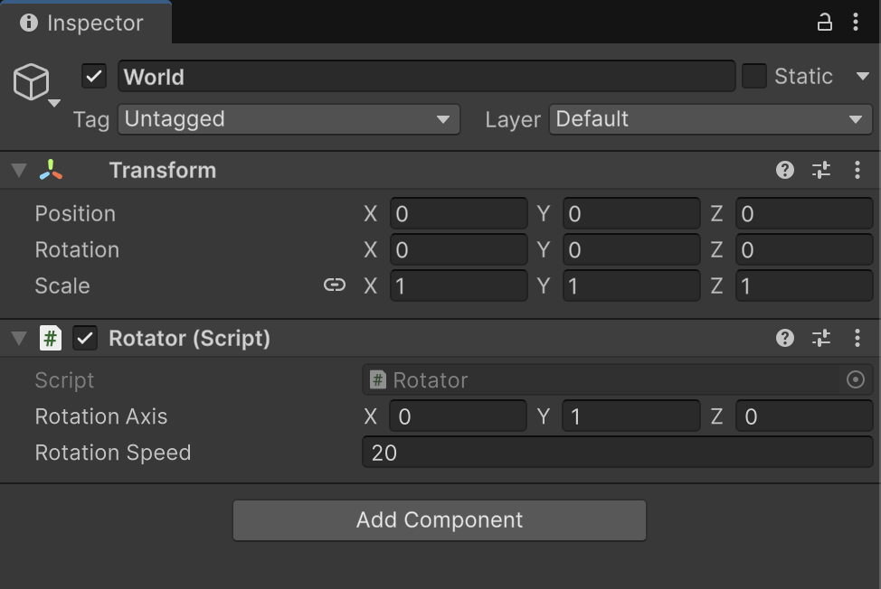

# Exercise

* From the Asset Store, add the following package to your assets:



* Download it and **import** it into your project through the _Package Manager_ Window

<figure><figcaption></figcaption></figure>

* Create an child, **empty GameObject**, on the target. Call it "_World_" and set its **position** and **rotation** to (0,0,0), and its **scale** to (1,1,1)

<figure><figcaption></figcaption></figure>

* Add as many prefabs as you want from the downloaded package, as children of the "_World_" GameObject. You'll need to adjust the position, rotation and scale of the elements you drag.

<figure><figcaption></figcaption></figure>

* **Create** and **add** the following script on the "World" GameObject, making sure you fill the gaps!!!

```csharp
using UnityEngine;

public class Rotator : MonoBehaviour
{
    public Vector3 rotationAxis = Vector3.up;
    public float rotationSpeed = 10f;

    private bool _shouldRotate = false;

    public void OnTargetFound()
    {
        _shouldRotate = true;
    }
    
    public void OnTargetLost()
    {
        _shouldRotate = false;
        transform.eulerAngles = Vector3.zero;   // Reset rotation
    }

    private void Update()
    {
        if (_shouldRotate)
            transform.Rotate(/* Axis */, /* Frame-independend speed */);
    }
}
```

<figure><figcaption></figcaption></figure>

* Link the events from the `ImageTargetBehaviour` to play/pause the rotation whenever the target is found/lost

<figure><figcaption></figcaption></figure>

### Result

<figure><figcaption></figcaption></figure>

***

## Challenge

* Add a **GUI** to **stop and resume the rotation** while the target is being tracked
* Add a **particles effect** and **BG music** whenever the target is found
* Add a little **scale up & down effect** whenever the **user touches** any element within the target. You can use the [DOTween](https://dotween.demigiant.com/documentation.php) package
